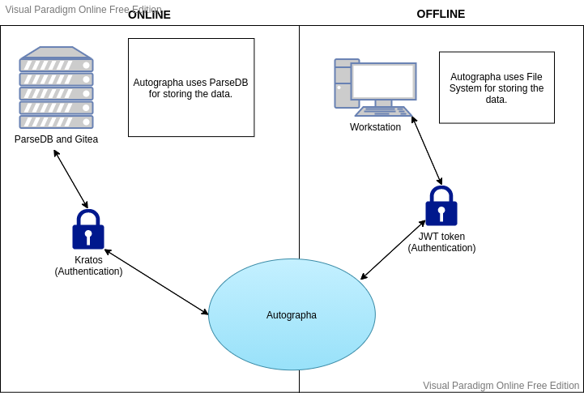
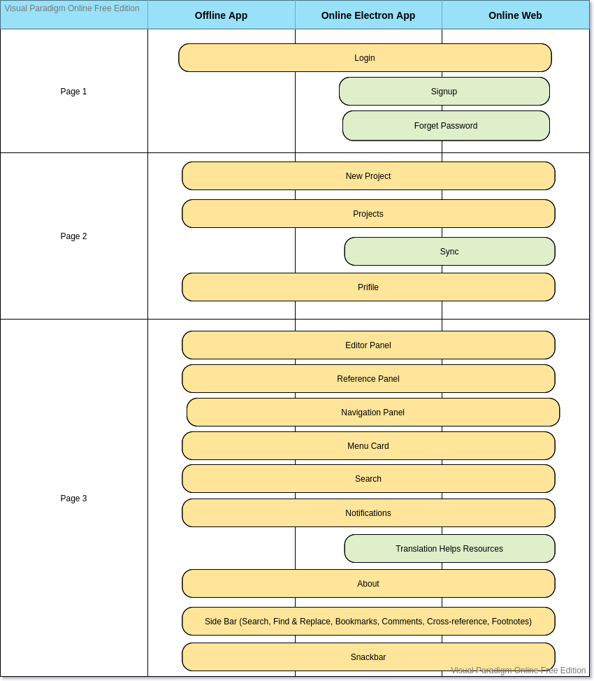
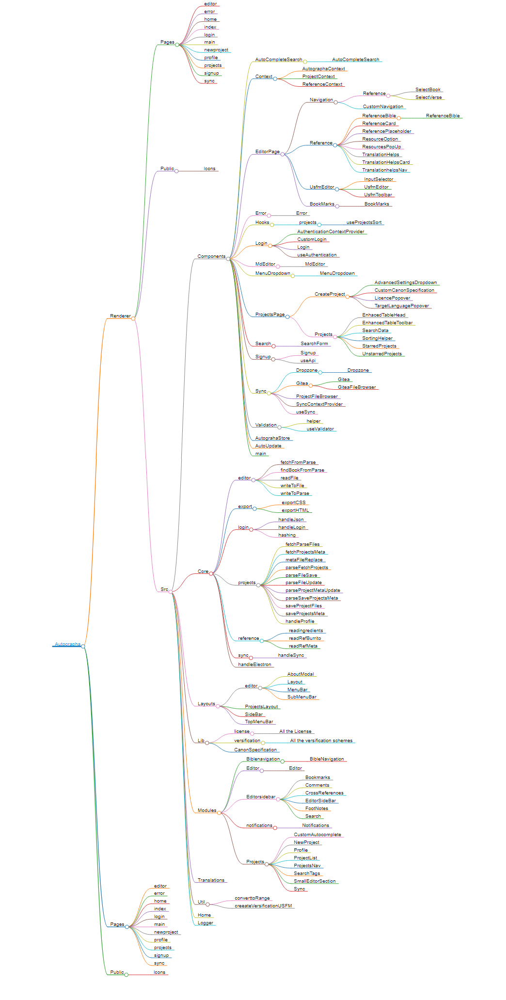

# Autographa Version 2

## Architecture

This document describes the high-level architecture of Autographa. This is intended to guide you to familiarize yourself with the code base.

## Bird's Eye View

_Process diagram_

Autographa is an easy-to-use translation software widely used for Bible translations.

Implemented Using

-   React JS
-   Next JS
-   Electron / Electronite
-   Node JS
-   ParseDB
-   File System
-   Tailwind CSS
-   Headless MaterialUI

## Broad View

_Major Components diagram_

## Code Map

This section talks briefly about various directories. It would give you ideas on where to find things you are looking for, in the code base.

_Code Structure diagram_

[Interactive HTML](./CodeStructure.html)

### src/components

Contains individual functional React components that can be highly re-usable.

-   Contains `context` based state management system for synchronous approach.
-   The context files are placed inside `components/context` as `{Contextname}Context.js`.
-   `components/hooks` contains `CustomHooks` for multiple use-cases and it can be pulled inside `context` for synchronisation.

### src/core

Core has all the backend functionalities.

### src/layouts

-   Layout consist of re-usable static UI components for all the page.
-   Layouts are used to wrap your Templates and provide them with the components which will be displayed by default in a specific layout.

### src/lib

This folder will hold other resources/compiled data, such as JSON files, license, versification schemes etc.

-   Keep all the global constants here.

### src/modules

Modules are build outy of multiple components or elements. This could be a header or footer or perticular feature element.

### src/util

Consist of `helper functions`, JS functions which will be used multiple times.

### src/public

Next.js uses this directory to statically serve files like `static.txt or icons.svg`. [Info](https://nextjs.org/docs/basic-features/static-file-serving)

### Internationalization

-   App uses `i18next` module to integrate the App Translation/Localisation.
-   Translation JSON files are placed in `src/translations`.
-   [Integration details](https://www.freecodecamp.org/news/setting-up-internationalization-in-react-from-start-to-finish-6cb94a7af725/)

### Tests

-   Component test has been done using Jest and React testing Library.
-   Each component consists of its component test i.e. Unit testing (DOM and functionality testing).
-   Test file should be named as`{ComponentName}.test.js`.
-   [Refer example](https://github.com/testing-library/react-testing-library#basic-example)

### Logs

-   Autographa electron application uses `electron-log` module for the log integration.
-   It creates a file inside the configuration directory as `aglogger.log`.
-   Custom configuration for development, production kept inside `src/logger.js`.

### Renderer

-   This directory is used by the electron application with specific pages, public, JS config etc files.
-   Electron shares `renderer/src` directory with web application and differentiated with Electron Flag `isElectron()`.

### Pages

-   It consists of .js, .jsx, .ts, or .tsx file in the pages directory. Each page is associated with a route based on its file name [Info](https://nextjs.org/docs/basic-features/pages).
